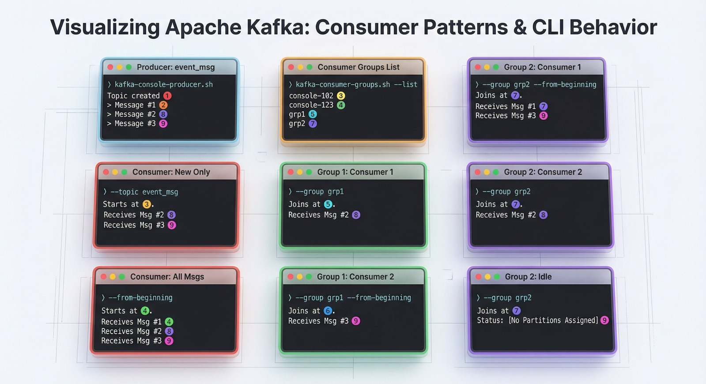

## Troubleshooting

Check Kafka container (kafka-1):
``` bash
docker exec -ti kafka-1 /opt/kafka/bin/kafka-metadata-quorum.sh --bootstrap-server kafka-1:19092 describe --status
# Example output:
# ClusterId:              MkU3OEVBNTcwNTJENDM2Qk
# LeaderId:               1
# LeaderEpoch:            9
# HighWatermark:          27893
# MaxFollowerLag:         1
# MaxFollowerLagTimeMs:   545
# CurrentVoters:          [{"id": 1, "endpoints": ["CONTROLLER://kafka-1:19093"]}, {"id": 2, "endpoints": ["CONTROLLER://kafka-2:19093"]}, {"id": 3, "endpoints": ["CONTROLLER://kafka-3:19093"]}]
```
### Kafka scenario
To see how Kafka is working, open 9 terminal windows and arrange them 3x3.
After that launch next command and follow steps:
`make kafka_run_scenario`

Use this image for explaining scenario working flow.
