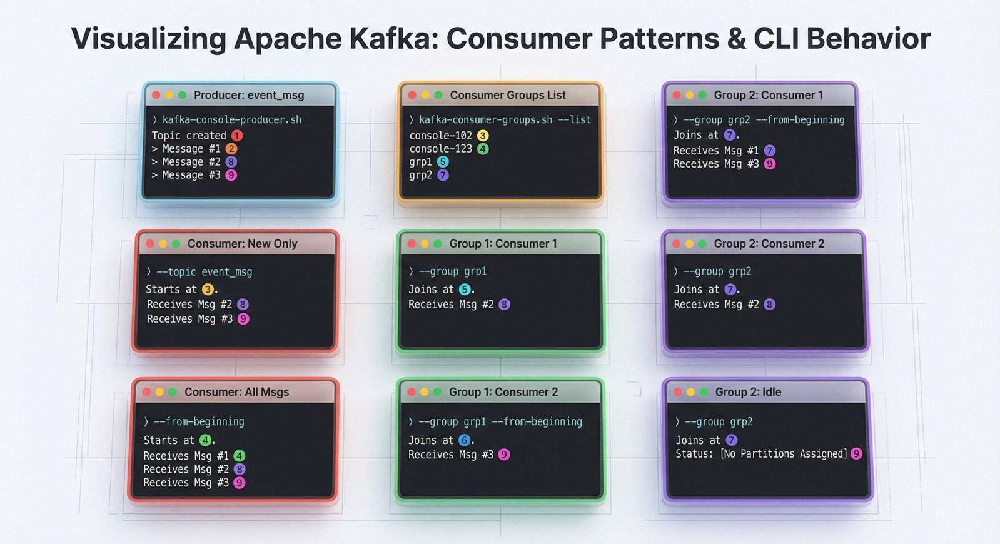

# Apache Kafka

> Apache Kafka is a distributed event streaming platform used for building real-time data pipelines and streaming applications.

This setup runs two containers:

- apache/kafka – the Kafka broker
- kafka-ui – a web interface for managing topics, messages, and consumers

The environment can be started with:

`make kafka_start`

and stopped with:

`make kafka_stop`

For Kafka, CLI-based scenarios are included to demonstrate:

- Producing messages
- Consuming messages
- Working with topics and partitions

These examples illustrate core Kafka concepts and typical usage flows.

## Troubleshooting

Check Kafka container (kafka-1):
``` bash
docker exec -ti kafka-1 /opt/kafka/bin/kafka-metadata-quorum.sh --bootstrap-server kafka-1:19092 describe --status
# Example output:
# ClusterId:              MkU3OEVBNTcwNTJENDM2Qk
# LeaderId:               1
# LeaderEpoch:            9
# HighWatermark:          27893
# MaxFollowerLag:         1
# MaxFollowerLagTimeMs:   545
# CurrentVoters:          [{"id": 1, "endpoints": ["CONTROLLER://kafka-1:19093"]}, {"id": 2, "endpoints": ["CONTROLLER://kafka-2:19093"]}, {"id": 3, "endpoints": ["CONTROLLER://kafka-3:19093"]}]
```

### Kafka scenario
There is a simple test scenario to understand Kafka topic, offsets, groups, producer and consumers. Open 9 consoles and postion its in as [3x3] matrix. Picture below visualise scenario final outcome: 


Run [scenario1.sh](/kafka/kafka_scenario1.sh) in top left console ([1,1]) by running command:
`make kafka_run_scenario`
 and follow the hints or you could run commands manually. There is script of test scenario:

#### Step #1
**Actions:** 
- In console **[1,1] (Producer)** create topic `event_msg`.
- In console **[1,2] (Watcher)** start monitoring consumer groups using `kafka-consumer-groups.sh --list`.

**Result:**
The topic is successfully created. No consumer groups exist yet.


#### Step #2
**Actions:**
 In console **[1,1] (Producer)** start `kafka-console-producer.sh --topic event_msg` and send **Message #1**.

**Result:**
Message #1 is stored in the topic, but it is not displayed as there are no any consumer started.

#### Step #3
**Actions:**
 In console **[2,1] (Standalone Consumer 1 – New Only)** start a consumer (group is not specified) using `--topic event_msg`.

**Result:**
This consumer does NOT receive **Message #1**  because it only reads new messages. A new autogenerated consumer group (e.g., `console-102`) appears in console **[1,2]**. Offset for this group is set to "latest".

#### Step #4
**Actions:**
 In console **[3,1] (Standalone Consumer 2 – All Msgs)** start a consumer with parameter `--from-beginning`.

**Result:**
This consumer immediately reads **Message #1** (and all other from the topic) from the beginning. Another autogenerated group (e.g., `console-123`) appears in **[1,2]**. Offest initially is set to 0, all messages are displayed, and offset become "latest".

#### Step #5
**Actions:**
 In console **[2,2] (Group 1 - Consumer 1 New Only)** start a consumer with `--group grp1`.

**Result:**
The consumer waits for new messages (no messages consumed yet). As it is default configuration to show latest messages for new groups, nothing displayed on the first group run (offset for `grp1=latest`). Group `grp1` appears in the group list **[1,2]**.

#### Step #6
**Actions:**
 In console **[3,2] (Group 1 – Consumer 2 New Only)** start a consumer with `--group grp1` and `--from-beginning`.

**Result:**
Consumer 2 in Group 1 is active and waiting for messages. Parameter `--from-beginning` is not working in this case, as it is not a new group. Group `grp1` offset is set to "latest". Group `grp1` already in list of groups in **[1,2]** - no changes here.

#### Step #7
**Actions:**
 Start additional consumers in the 3rd column - consoles: **[3,1]**, **[3,2]** and **[3,3]**. Use one command for all 3 consoles with parameters "... `--group grp2 --from-beginning`"
- In **[1,3] (Group 2 – Consumer 1 All Msg)** using `--group grp2 --from-beginning`
- In **[2,3] (Group 2 – Consumer 2 New Msg)** using `--group grp2 --from-beginning`
- In **[3,3] (Group 2 – Consumer 3 No Msgs)** using `--group grp2 --from-beginning`

**Result:**
- Consumers inside `grp2` share partitions.
- Consumer 1 immediately reads **Message #1** (and all other from the topic) from the beginning.
- Consumer 2 joins to the second partion, but do not display messages (all listed in Consumer 1).
- Consumer 3 does not display anything: old messages are displayd by Consumer 1, no available partitions for Consumer 3.

#### Step #8
**Actions:**
 In console **[1,1] (Producer)** send **Message #2**.

**Result:**
**Message #2** is delivered: 
- Standalone consumers **[2,1]** and **[3,1]** receive it.
- In `grp1`, only one consumer receives it (partition-based distribution).
- In `grp2`, the message is distributed to one assigned Consumer 2. 
All active consumers assigned to relevant partitions display **Message #2**.

#### Step #9
**Actions:**
 In console **[1,1] (Producer)** send **Message #3**.

**Result:**
**Message #3** is distributed according to group partition assignment:
- Standalone consumers  **[2,1]** and **[3,1]** display it.
- In `grp1`, it goes to the Consumer 2 owning that partition **[2,3]**.
- In `grp2`, one Consumer 1 may show it while another Consumer 3 remains idle (`No Partitions Assigned if applicable`).

#### Bonus steps 
*Steps 10-19 in [scenario1.sh](/kafka/kafka_scenario1.sh)*:
- Restore consumer after stop with or without group;
- JSON sending, common errors;
- Sending message with key.
